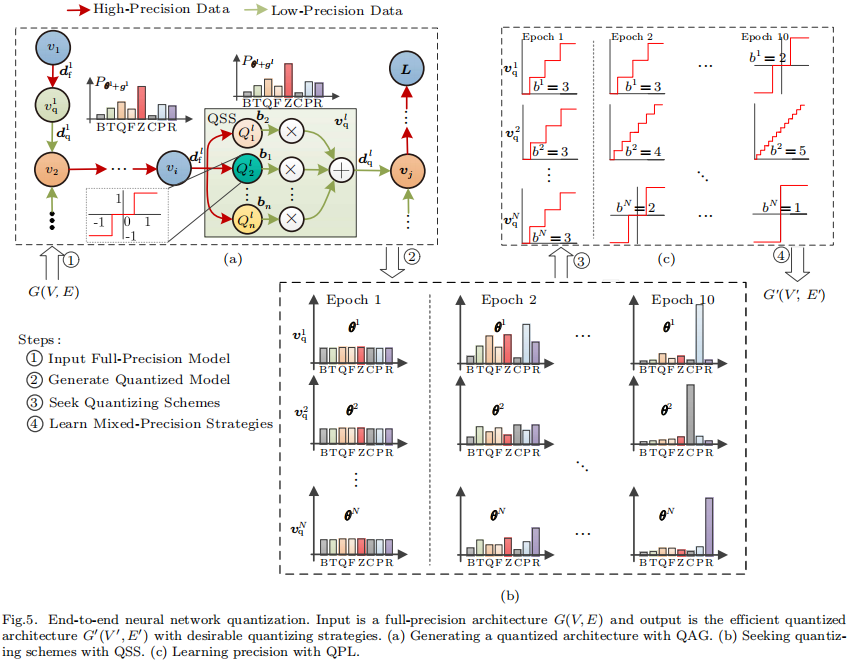
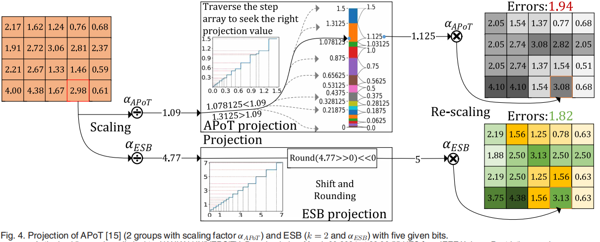
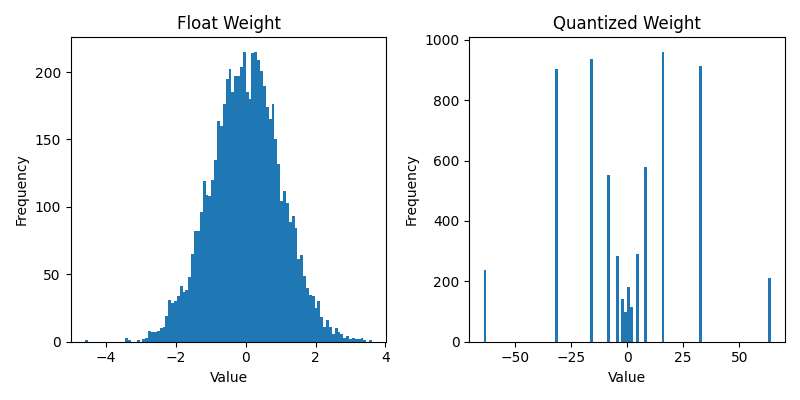

# AutoQNN
**AutoQNN** is an efficient, end-to-end framework designed for the automatic quantization of various layers within Deep Neural Networks (DNNs), employing diverse schemes and bitwidths without any manual intervention.
Your can find our paper [here](https://jcst.ict.ac.cn/en/article/doi/10.1007/s11390-022-1632-9).
This repository contains the open-source implementation of AutoQNN using PyTorch.

AutoQNN aims to identify optimal quantization schemes and mixed-precision policies for mainstream DNN models in an efficient manner by incorporating techniques such as Quantization Scheme Search (QSS) and Quantizing Precision Learning (QPL). 
QSS introduces a diverse set of typical quantizers as candidates for the search process and employs the Differentiable Neural Architecture Search (DNAS) algorithm to identify the desired scheme for each layer or the entire model.
QPL is an innovative approach that learns mixed-precision policies by reparameterizing the bitwidths associated with quantization schemes. It efficiently optimizes both the classification loss and the precision loss of DNNs, achieving a relatively optimal mixed-precision model while maintaining a constrained model size and memory footprint.



## Installation
We provide the Python package for installation, and you can use the following command to install AutoQNN. You can also clone this repository to modify the source code. 
```bash
# Install AutoQNN form Gitee
pip install git+git://gitee.com/GooCee/AutoQNN-pytorch.git
```

```bash
# Install AutoQNN form Github
pip install git+git://github.com/GongCheng1919/autoqnn-pytorch.git
```

## Usage of AutoQNN Framework
We offer a user-friendly quantization framework for PyTorch named AutoQNN-PyTorch, which includes many classic quantization algorithms such as TWNs, Fixed Quantizer, Residual Quantizer, VecQ, μL2Q, and ESB Quantizer.
You can find all the quantization algorithms in the directory [here](./autoqnn/quantizers/).

Moreover, you can refer to our quantization interface to easily define your own quantization algorithm.
Below is an example of how to use this framework to quantize a PyTorch model.

```python
import sys
import torch
import numpy as np
import matplotlib.pyplot as plt
import autoqnn
from torch import nn
from autoqnn.utils import view_module
import torch.nn.functional as F

module = YourModel()
q_model = autoqnn.core.convert(module,
    quantize_config_dict={
        "weight_quant":autoqnn.quantizers.FixedQuant(bitwidth=4),
        "act_quant":autoqnn.quantizers.FixedQuantAct(bitwidth=4)
    }
)
```

## Usage of ESB quantizer
The ESB quantizer is a novel nonlinear quantizer designed for Deep Neural Networks (DNNs). It offers an accurate and efficient quantization mapping along with a hardware-friendly quantizing format, enabling the simultaneous maintenance of both accuracy and hardware efficiency. You can find the associated paper [here](https://ieeexplore.ieee.org/abstract/document/9623507). 


We have implemented the ESB quantizer within the AutoQNN framework. To enable the ESB quantizer in your quantization process, you can use the following code snippet:
```python
module = YouModel()
esb_quantizer = autoqnn.quantizers.ESB_PerChannel(
    bitwidth=4,
    linear_bits=1, // Number of significant bits
    per_channel=False, 
    mean_shift=False // Do not enable symmetric quantization
)
q_model = autoqnn.core.convert(module, 
    quantize_config_dict={
        "weight_quant":esb_quantizer,
        "act_quant":autoqnn.quantizers.FixedQuantAct(bitwidth=4)
    }
)
```
We provide a histogram comparing the floating-point weights and the quantized weights using the ESB quantizer in the following figure:



## Citations
If you find our work useful, please consider citing them in your publications.

AutoQNN:
```bibtex
@article{gong2024autoqnn,
  title={AutoQNN: An End-to-End Framework for Automatically Quantizing Neural Networks},
  author={Gong, Cheng and Lu, Ye and Dai, Su-Rong and Deng, Qian and Du, Cheng-Kun and Li, Tao},
  journal={Journal of Computer Science and Technology},
  volume={39},
  number={2},
  pages={401--420},
  year={2024},
  publisher={Springer}
}
```

ESB:
```bibtex
@article{gong2022elastic,
  title={Elastic Significant Bit Quantization and Acceleration for Deep Neural Networks},
  author={Gong, Cheng and Lu, Ye and Xie, Kunpeng and Jin, Zongming and Li, Tao and Wang, Yanzhi},
  journal={IEEE Transactions on Parallel \& Distributed Systems},
  volume={33},
  number={11},
  pages={3178--3193},
  year={2022},
  publisher={IEEE Computer Society}
}
```